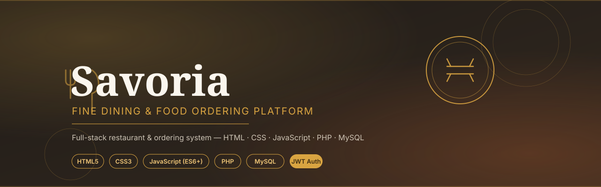

# 🍽️ Savoria — Fine Dining & Food Ordering Platform

A complete full-stack project suite built with **HTML5, CSS3, vanilla JavaScript, PHP, and MySQL** — structured as four progressive, standalone projects plus one combined application, mirroring a real internship-style deliverable pipeline.

**Savoria** is a fine-dining restaurant and food-ordering brand: a menu system, cart & checkout, table reservations, and full authentication with role-based access control (customer / staff / admin).

## 📁 Project Structure

```
savoria-fullstack-complete/
├── project-1-frontend-static/       # Pure HTML/CSS/JS landing page (no backend)
├── project-2-backend-api-json/      # PHP REST API, JSON-file storage
├── project-3-database-integration/  # PHP + MySQL (PDO), full CRUD, transactions
├── project-4-auth-authorization/    # JWT auth + role-based access control
├── full-stack-complete-app/         # Everything combined: live site + API + DB
├── LICENSE
└── README.md                        # You are here
```

## 🧭 How to Navigate This Suite

Each project builds on the last, isolating one concern at a time — useful both as a learning progression and as four distinct, submission-ready deliverables:

| # | Project | Focus | Storage |
|---|---|---|---|
| 1 | [Static Frontend](project-1-frontend-static/) | Responsive UI, animations, client-side form validation | None (static demo) |
| 2 | [Backend API (JSON)](project-2-backend-api-json/) | REST routing, request validation, response design | Flat JSON files |
| 3 | [Database Integration](project-3-database-integration/) | PDO, prepared statements, transactions, relational schema | MySQL |
| 4 | [Auth & Authorization](project-4-auth-authorization/) | JWT, bcrypt, RBAC middleware | MySQL |
| — | [Full-Stack Complete App](full-stack-complete-app/) | Everything above, combined into one working product | MySQL |

Each project folder has its own `README.md` with setup instructions, an API reference (where applicable), and design notes.

## 🎨 Design System — "Ember"

A warm, upscale palette distinct from typical SaaS blues: **charcoal** (`#1F1B18`), **terracotta** (`#C4602E`), and **antique gold** (`#D9A441`) on a **cream** background, paired with Playfair Display for headings and Inter for body text.

## 🛠️ Tech Stack

- **Frontend:** HTML5, CSS3 (custom properties, Grid/Flexbox, no framework), vanilla JavaScript (ES6+, `fetch`, `IntersectionObserver`)
- **Backend:** PHP 8+ (no framework — plain front-controller routing)
- **Database:** MySQL 8 / MariaDB (PDO with prepared statements throughout)
- **Auth:** Hand-rolled HS256 JWT + bcrypt password hashing

## 🚀 Fastest Path to a Running Demo

```bash
cd full-stack-complete-app
mysql -u root -p < database/savoria_full_schema.sql
cd backend && cp .env.example .env && php -S localhost:8000 index.php &
cd ../frontend && python3 -m http.server 8080
```

Then open `http://localhost:8080`.

