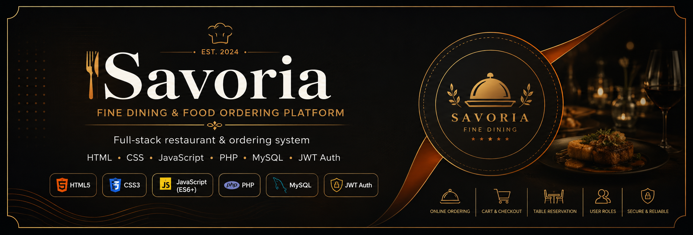
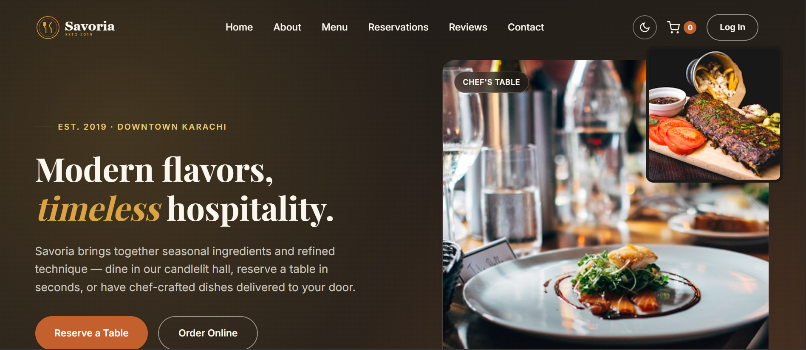
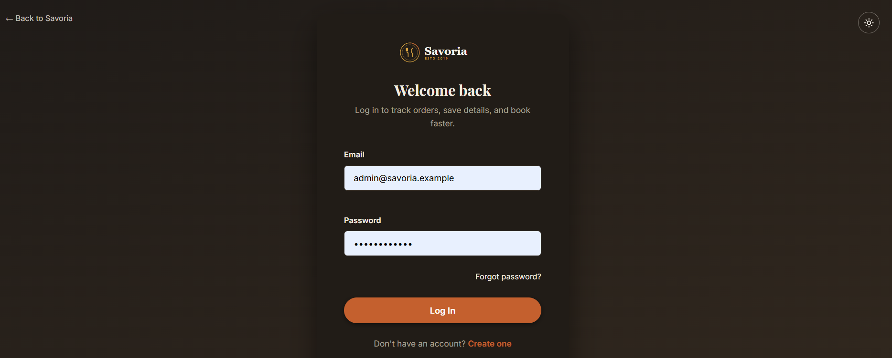
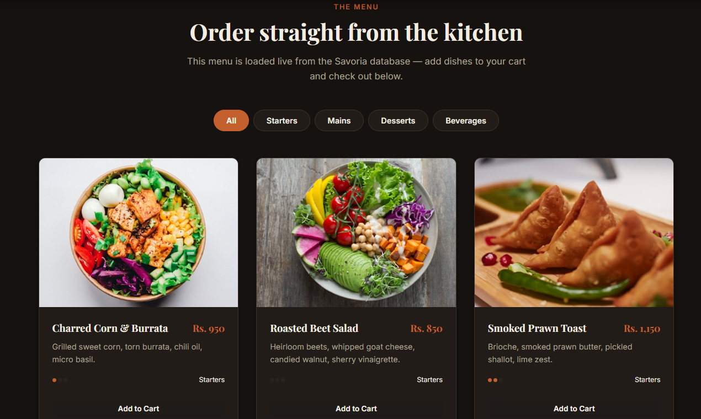
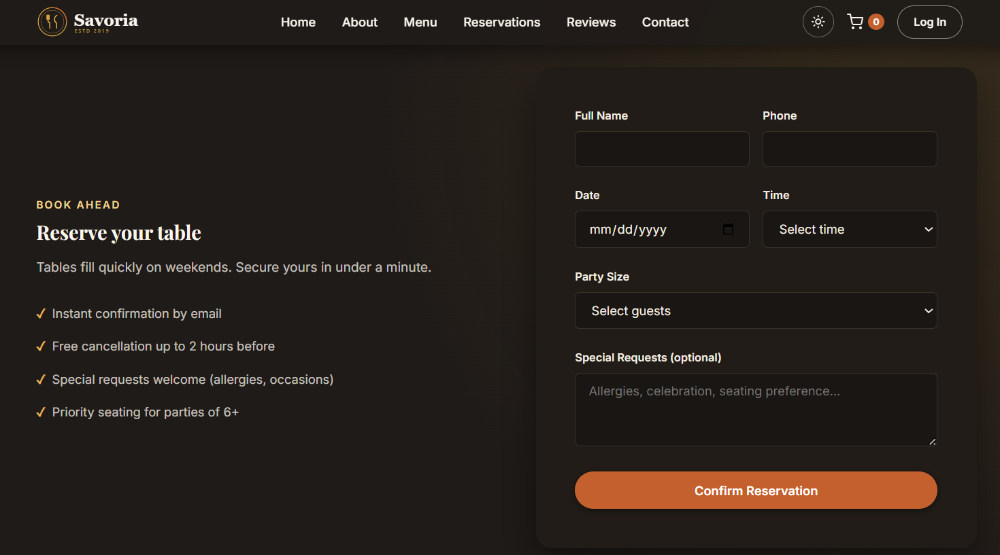
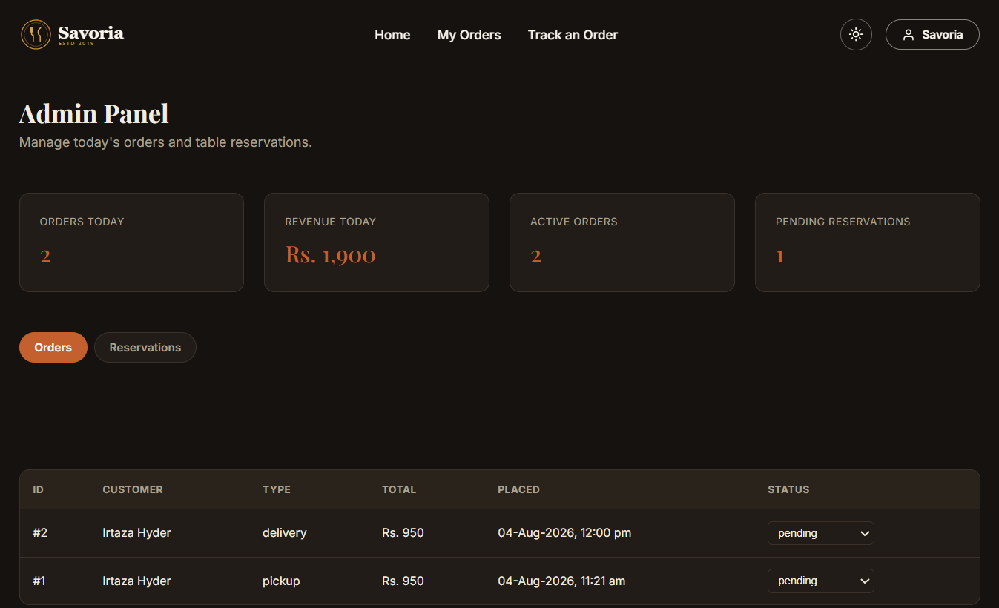

<p align="center">
  
</p>

<h1 align="center">🛎️ Savoria – Full Stack Restaurant Management System</h1>

<p align="center">
A modern Full Stack Restaurant Management & Food Ordering Platform developed during the
<strong>DecodeLabs Full Stack Development Internship (Batch 2026)</strong>.
</p>

<p align="center">

  
  
  
  
  
  
  
  
  
  
  
  

</p>

# 📖 Overview

This repository contains all projects completed during the **DecodeLabs Full Stack Development Internship**.

The internship follows a progressive learning path, beginning with frontend development and ending with a complete Full Stack Restaurant Management System featuring secure authentication, REST APIs, MySQL database integration, and role-based authorization.

The final application **Savoria** combines all internship milestones into a production-style web application.

---

# ✨ Main Features

- 🛎️ Restaurant Website
- 📋 Dynamic Food Menu
- 🛒 Shopping Cart
- 💳 Checkout System
- 🪑 Table Reservation
- 👤 Customer Dashboard
- 👨‍💼 Admin Dashboard
- 🔐 JWT Authentication
- 🛡️ Role-Based Authorization
- 📦 Order Management
- 🗄️ MySQL Database
- 📱 Fully Responsive Design

---

# 📸 Project Screenshots

## 🏠 Home Page



---

## 🔐 Login Page



---

## 🍽️ Menu Page



---

## 📝 Registration Page



---

## 👨‍💼 Admin Dashboard



---


# 📂 Repository Structure

```text
DecodeLabs-Internship
│
├── screenshots/
│
├── full-stack-complete-app/
│
├── project-1-frontend-static/
│
├── project-2-backend-api-json/
│
├── project-3-database-integration/
│
├── project-4-auth-authorization/
│
├── banner.png
│
└── README.md
```

---

# 📌 Internship Projects

## 🌿 Project 1 — Frontend Static

### Features

- Responsive UI
- HTML5
- CSS3
- JavaScript
- Mobile Friendly
- Interactive Components

---

## ⚙️ Project 2 — Backend API

### Features

- REST API
- JSON Storage
- CRUD Operations
- Validation
- HTTP Responses

---

## 🗄️ Project 3 — Database Integration

### Features

- MySQL
- PDO
- CRUD Operations
- Prepared Statements
- SQL Injection Protection

---

## 🔐 Project 4 — Authentication & Authorization

### Features

- User Registration
- Secure Login
- Password Hashing
- JWT Authentication
- RBAC
- Protected APIs

---

## ⭐ Full Stack Complete Application

Includes

- Complete Frontend
- PHP Backend
- REST APIs
- JWT Authentication
- MySQL Database
- Shopping Cart
- Checkout
- Reservations
- Customer Dashboard
- Admin Dashboard

---

# 🎨 Design System

### Theme

Premium Restaurant Experience

### Color Palette

- 🖤 Charcoal
- 🧡 Terracotta
- 💛 Antique Gold
- 🤍 Cream

### Typography

- Playfair Display
- Inter

---

# 💻 Technology Stack

### Frontend

- HTML5
- CSS3
- JavaScript (ES6)

### Backend

- PHP 8+

### Database

- MySQL
- PDO

### Authentication

- JWT
- bcrypt
- Role-Based Access Control

### Tools

- Git
- GitHub
- VS Code
- XAMPP

---

# 🚀 Installation

## Clone Repository

```bash
git clone https://github.com/irtazahyder834/DecodeLabs-Internship.git
```

---

## Navigate

```bash
cd full-stack-complete-app
```

---

## Import Database

```bash
mysql -u root -p < database/savoria_full_schema.sql
```

---

## Start Backend

```bash
cd backend

php -S localhost:8000 index.php
```

---

## Start Frontend

```bash
cd ../frontend

php -S localhost:5500
```

---

## Open Browser

```
http://localhost:5500
```

---

# 📌 Future Improvements

- 💳 Online Payment Gateway
- 📧 Email Notifications
- 📱 Progressive Web App
- 📈 Analytics Dashboard
- 🍕 Live Order Tracking
- 🌐 Multi-language Support
- 🔔 Push Notifications
- ⭐ Customer Reviews
- ❤️ Wishlist
- 🎁 Discount Coupons

---

# 👨‍💻 Developer

## Irtaza Hyder

**BS Computer Science**

**Full Stack Developer**

DecodeLabs Full Stack Development Internship — Batch 2026

### Skills

- HTML5
- CSS3
- JavaScript
- PHP
- MySQL
- REST API
- JWT
- Git
- GitHub

---

# 🤝 Contributing

Contributions, issues, and feature requests are welcome.

Feel free to fork this repository and submit a Pull Request.


# ⭐ Support

If you found this repository helpful,

please consider giving it a ⭐ Star.

It helps support future projects.

---

<h3 align="center">
Made with ❤️ by Irtaza Hyder
</h3>
